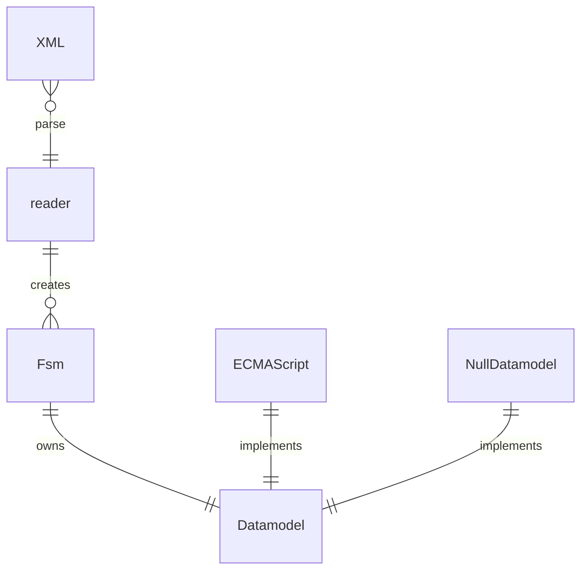
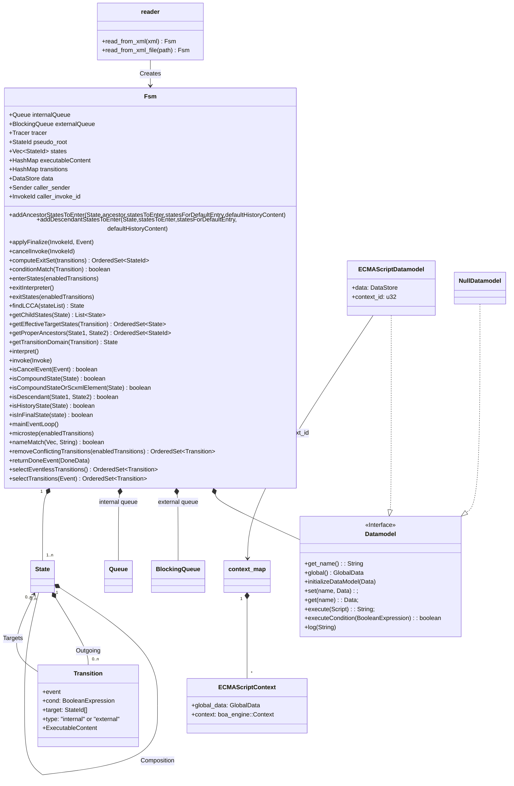

# Finite State Machine (FSM) Implementation in Rust

According to W3C Recommendations, reading State Chart XML (SCXML).

See https://www.w3.org/TR/scxml/

To-Do:

+ Implement XML-Reading _(ongoing)_
+ Implement the model (fsm, states etc.) _(mostly finished)_
+ <s>Implement Datastructures needed (Queue etc.)-- _(finished)_</s>
+ Implement w3c algorithm (mostly finished).
+ Implement ECMAScript Datamodel _(ongoing)_
+ Design concept for "invoke"
    + Life-cycle control of threads / processes.
    + Communication: See Cancel-methods.  
      We can use events via external-queue, but spec doesn't force this.
    + In the Architecture below "caller_sender" and "caller_invoke_id"
      are added for supporting notification of invoker that triggered execution of this fsm.
+ Full Send implementation
    + Implement SCXML Event I/O Processor
        + Target \_internal
        + Target \_scxml\_*sessionid*
        + Target \_parent
        + Target *invokeid*
    + Maintain _ioprocessors Variable

## Architecture

SCXML is parsed via a SAX parser, using Crate `quick-xml`.
The resulting model can be moved to another thread.

### Overview

### Basic class diagram

The Fsm implements the methods described in the W3C Recommendation. The main loop is executed in a work-thread. The application sends events via a "BlockingQueue" (technical a
Channel). All scripts and conditional expressions are executed by the Datamodel. W3C defines that implementations may freely choose the script language to support. The mandatory
Null-Datamodel is a dummy implementation with minimal functionality.

In this implementation ECMAScript is integrated (if feature "ECMAScript" is active). It uses [boa-engine](https://boajs.dev/). Boa claims to have a ~75% conformance to the
Standard. So don't expect to have 100% JavaScript here.

You can check the requirements for ECMA in SCXML [here](https://www.w3.org/TR/scxml/#ecma-profile)

### Not conformant or not implemented features of the W3C recommendation

+ XML inside &lt;content> is not handled accoring to _[content_and_namespaces](https://www.w3.org/TR/scxml/#content_and_namespaces)_. The content inside &lt;content> is not
  interpreted and send to the receiver unmodified.

### Internal Data Management

The FSM has - conceptually - a lot of cross-references between states, transitions and other stuff. Such relationships are not easy to implement with Rust. The usual way is to NOT
refer to the entities directly and use IDs instead. The IDs reference the entities in a common memory area (see structure "GlobalData"). With that Rust doesn't have any issues with
the child/parent relationships in the model.

### Logging

The project use crate "log". If the feature "EnvLog" is active, the crate "env_log" is used as "log" implementation.

The module reader prints the SAX-events to "log::debug".\
FSM methods, state transitions and output are traces via a trait "fsm::Tracer" with a default implementation that prints to "info".\
The Tracer can be replaced by the using client by some other implementation or it can be configured to print only specific information. 
The Tracer has different flags to control what is traced, see Enum Trace for details.

The used log level of crate "log" can be controlled by environment variable "RUST_LOG", e.g. "RUST_LOG=debug".

### Testing

For testing your scxml you can use the main-function of the project.

`rfsm MySM.scxml`

The scxml will be parsed and the resulting FSM will be executed. The app prompts for events that are send via the external-event-queue. Enter 'help' to display some usage
information.

Remind that Tracer uses "log" for any output, to see it on console, you will need to set the log level before starting rfsm. E.g. by a`export RUST_LOG=debug`
or depending on your OS, `set RUST_LOG=debug`.
