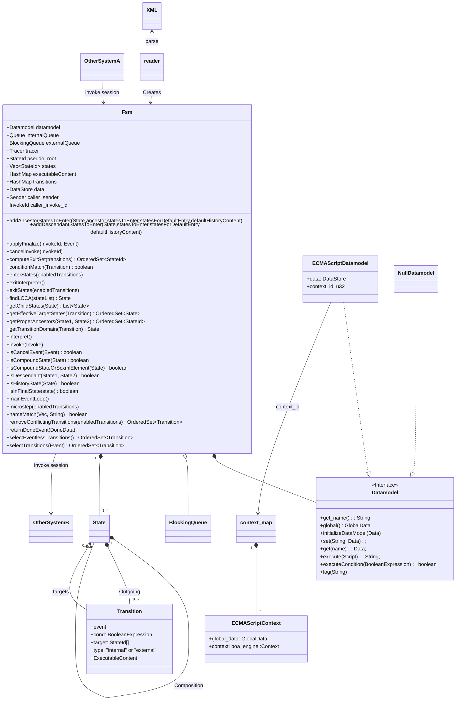

# Finite State Machine Implementation in RUST

According to W3C Recommendations

See https://www.w3.org/TR/scxml/

To-Do:

+ Implement XML-Reading _(ongoing)_
+ Implement the model (fsm, states etc.) _(mostly finished)_
+ <s>Implement Datastructures needed (Queue etc.)-- _(finished)_</s>
+ Implement w3c algorithm (mostly finished).
+ Implement ECMAScript Datamodel _(ongoing)_
+ Design concept for "invoke"
    + Life-cycle control of threads / processes.
    + Communication: See Cancel-methods.  
      We can use events via external-queue, but spec doesn't force this.
    + In the Architecture below "caller_sender" and "caller_invoke_id"
      are added for supporting notification of invoker that triggered execution of this fsm.

## Architecture

