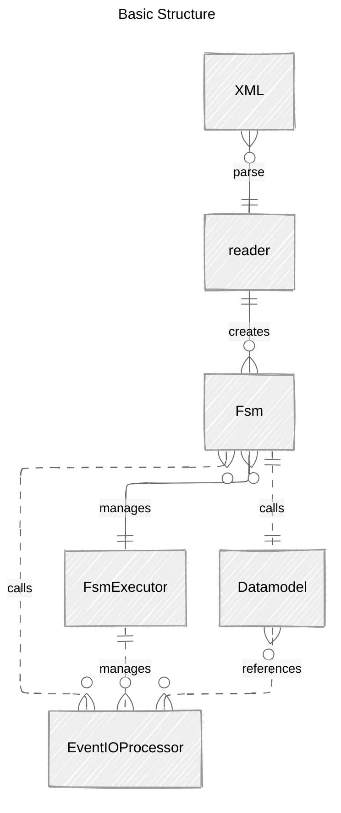
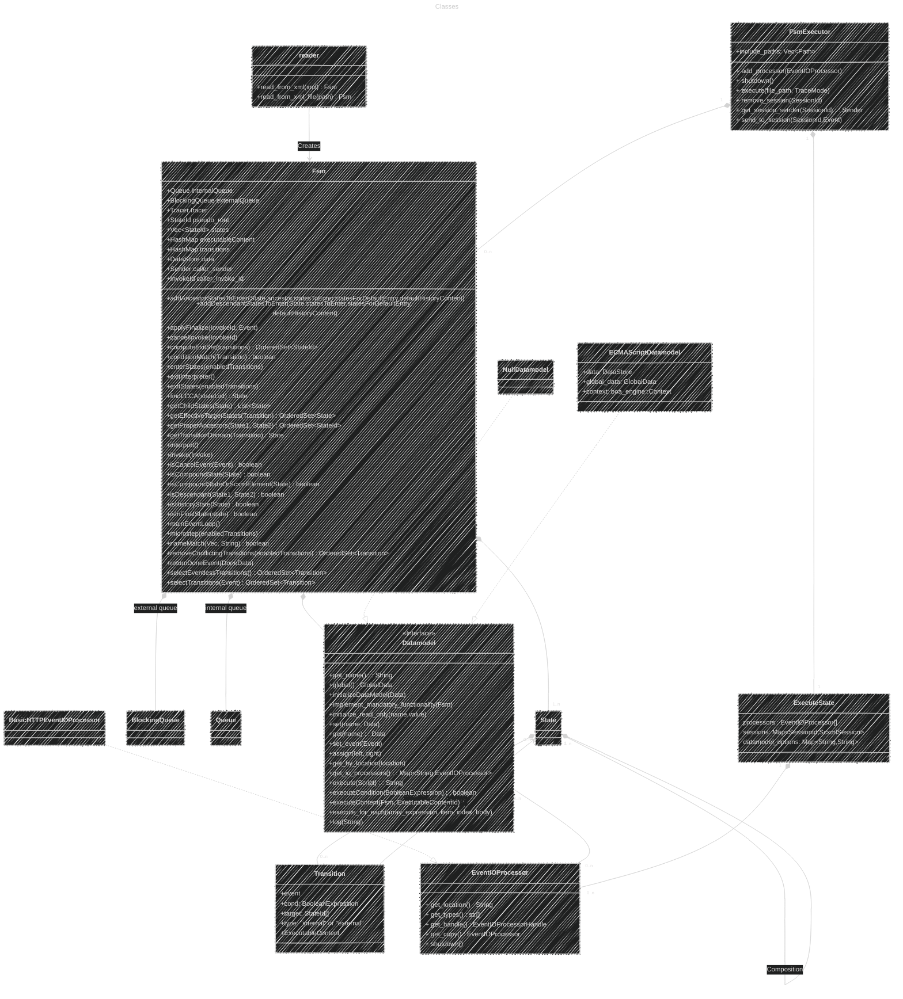

# The Software Design

SCXML is parsed via a SAX parser, using Crate `quick-xml`.
The resulting model is then moved to a worker thread where the FSM waits for events.
Multiple FSM can work in parallel and communicate via their external event-queues (using channels).

A Datamodel-instance is associated with each FSM-instance.

All active Fsm-sessions are managed by the FsmExecutor. 

## Details

The Fsm implements the algorithm described in the W3C Recommendation. The main loop is executed in a work-thread. The application sends events via a "BlockingQueue" (technical a
Channel). All scripts and conditional expressions are executed by the Datamodel. W3C defines that implementations may freely choose the script language to support. The mandatory
Null-Datamodel is a dummy implementation with minimal functionality.

In this implementation ECMAScript is integrated (if feature "ECMAScript" is active). It uses [boa-engine](https://boajs.dev/). Boa claims to have a ~75% conformance to the
Standard. So don't expect to have 100% JavaScript here.

You can check the requirements for ECMA in SCXML [here](https://www.w3.org/TR/scxml/#ecma-profile)

Names from the W3C pseudo-code-algorithm are kept were feasible and not converted to Rust-like snake case.
These methods are marked with "_#[allow(non_snake_case)]_" to suppress warnings.

## Structure

## Basic class diagram

### Internal Data Management

The FSM has - conceptually - a lot of cross-references between states, transitions and other stuff. Such relationships are not easy to implement with Rust. The usual way is to NOT
refer to the entities directly and use IDs instead. The IDs reference the entities in a common memory area (see structure "GlobalData"). With that Rust doesn't have any issues with
the child/parent relationships in the model.

### Logging

The project use crate "log". If the feature "EnvLog" is active, the crate "env_log" is used as "log" implementation.

The module reader prints the SAX-events to "log::debug".\
FSM methods, state transitions and output are traces via a trait "fsm::Tracer" with a default implementation that prints to "info".\
The Tracer can be replaced by the using client by some other implementation, or it can be configured to print only specific information.
The Tracer has different flags to control what is traced, see Enum [TraceMode](src/tracer.rs) for details.

The used log level of crate "log" can be controlled by environment variable "RUST_LOG", e.g. "RUST_LOG=debug".

### Manual Tests

For manual testing your scxml you can use the "fsm" binary of the project.

`fsm MySM.scxml`

The scxml will be parsed and the resulting FSM will be executed. The app prompts for events that are send via the external-event-queue. Enter 'help' to display some usage
information.

Remind that Tracer uses "log" for any output, to see it on console, you will need to set the log level before starting rfsm. E.g. by a`export RUST_LOG=debug`
or depending on your OS, `set RUST_LOG=debug`.

### Automated Testing

For automated tests the binary `test` can be used. The schema for the configuration files is _[schema/test_specification_schema.json](schema/test_specification_schema.json)_.

For a practical application see [test/w3c/README.md](test/w3c/README.md).
